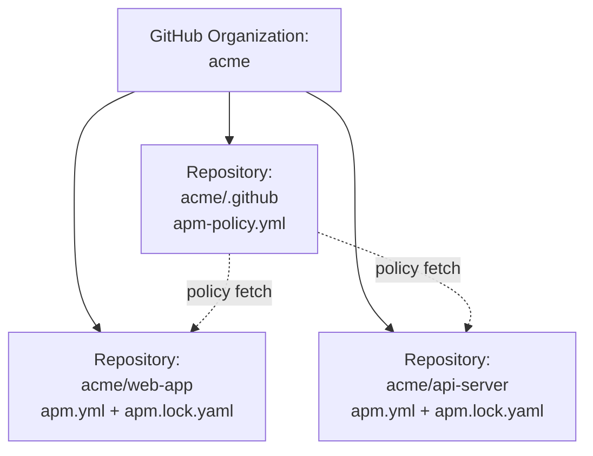
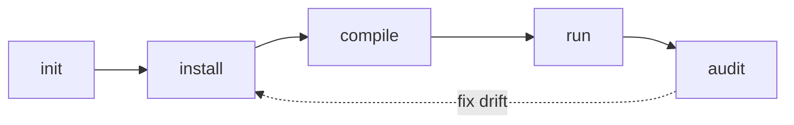
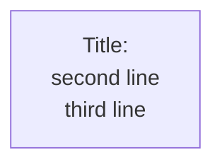
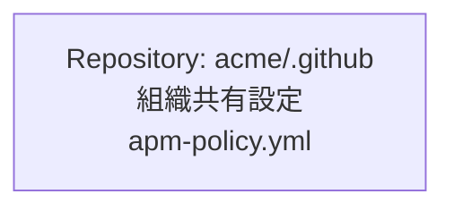

# Phase 4: Japanese Writing Rules

日本語の技術ブログ記事として読みやすいテキストを書くためのルール集。

## 大原則: ルー語禁止

**ルー語** = 英単語を不必要に日本語文に混入させる話法（タレントのルー大柴に由来）。

ここで言う「不必要」とは、訳語が定着していたり、自然な日本語句に組み替えられたりするにもかかわらず、英単語をそのまま動詞・形容動詞・名詞として活用させて使うこと。次の 6 パターンが代表例:

### NG パターン一覧

| カテゴリ | NG | OK |
|---|---|---|
| **1. 英動詞のサ変動詞化** | gate される | ゲートにかけられる / 関門で止まる |
| 同上 | scan する | スキャンする (カタカナで日本語化済み) |
| 同上 | pin する | 固定する / ピン留めする |
| 同上 | fan-out する | 展開する / 配信する |
| 同上 | embed する | 埋め込む |
| 同上 | intersect する | 交差する |
| 同上 | fail-closed する | 失敗時にブロックする |
| **2. 英単語 + 化された / 化する** | コード化された rubric | 機械可読な採点基準 |
| 同上 | サイロ化された組織 | 部署が分断された組織 |
| **3. 英単語 + ベース** | rubric ベース | 採点基準に基づく / ルーブリック方式 |
| 同上 | template ベース | テンプレートに基づく |
| **4. 英単語 + 的 (な/に) / 風 / -like / ライク** | echo 的な動作 | エコーバックする動作 |
| 同上 | TDD-like なリズム | TDD 的なリズム |
| 同上 | agentic モード | 自律実行モード |
| **5. 英単語 + に + 動詞 (副詞化)** | literal にチェック | 文字どおりに照合 |
| 同上 | gracefully に終了 | 穏便に終了 / 正しく終了処理する |
| **6. 訳語が定着している英単語の地のまま使用** | reliability | 信頼性 |
| 同上 | maintainability | 保守性 |
| 同上 | observability | 可観測性 |
| 同上 | rubric | 採点基準 / ルーブリック |

### OK パターン: 固有名詞・術語の英語表記

技術用語を **対象を指す名詞** として地のまま使うのは OK。記事のトーンに馴染む:

- `apm.yml`, `lockfile`, `manifest`, `primitive`, `harness`, `frontmatter`
- `Pull Request`, `branch`, `merge commit`
- `OpenTelemetry`, `Prometheus`, `Kubernetes`
- `LLM-as-judge`, `MCP`, `SDK`

判断軸: **そのカタカナ語が日本語として既に流通しているか**、また **既に定着した日本語訳語があるか**。

- 「インストール」「スキャン」「コンパイル」「マージ」 → OK (流通している)
- 「ゲート (する)」「ピン (する)」「フェイルクローズド (する)」 → NG (不自然)
- 「信頼性」「保守性」「可観測性」 → 訳語が定着 → reliability などをそのまま使うのは NG
- `frontmatter`, `lockfile`, `manifest` → 翻訳すると逆に分かりにくい → 英語のまま OK

これらをカタカナに直すかは趣味の問題。記事全体で **一貫させる** ことだけ守れば OK。

### 判定の毎回チェック

書きながら、英単語の後ろが次のいずれかなら一度立ち止まる:

1. 「〜する」「〜される」「〜した」 (NG パターン 1)
2. 「〜化された」「〜化する」 (NG パターン 2)
3. 「〜ベース」 (NG パターン 3)
4. 「〜的(な/に)」「〜風」「〜-like」「〜ライク」 (NG パターン 4)
5. 「〜に + 漢字/かな動詞」 (NG パターン 5)
6. (英単語が単独で文中に裸で置かれていて、定着した訳語がある場合) (NG パターン 6)

該当したら訳語に置き換えるか、文を組み替える。組み替えられないなら、英単語の使用を諦める。

## 名詞-動詞の意味的整合

文法的に破綻していなくても、意味的に咬み合わない名詞-動詞の組み合わせを書いてしまうことがある。**動詞の主語/目的語が、その動詞の対象になり得るか** を文ごとにチェックする。

### NG パターン

- 「Skill **工程** に <備わる/揃う>」 ── 工程は備わる/揃う主体になりにくい (備わる主体は通常「人」「組織」「ツール」)
- 「`eval.yaml` の **隣** を探索」 ── ファイルに「隣」という空間概念は成立しない
- 「テストが <持ち上げる>」 ── 抽象名詞 (テスト) を主語に物理動詞 (持ち上げる) を置く

### 修正

主語または動詞を、意味的に咬み合うものに置き換える:

- 「Skill **工程** に揃っていない」 → 「Skill **開発の側** に備わっていない」(主語を「人/開発者側」に変更)
- 「`eval.yaml` の隣を探索」 → 「`eval.yaml` と同じディレクトリにある〜を検出」(空間比喩を物理的関係に置き換え)

このパターンは機械検出が難しい。**Phase 5 の self-review で全文を文単位で読み直す** ことでしか拾えない。

## 比喩・訳語の適切性

文脈に合わない比喩 / 無理な造語 / 空間的・視覚的比喩を使うと、読者は意味を取れない。

### NG パターン

- **無理な比喩**: 実行記録を「録画」(ビデオ的)、ファイル探索を「隣を探索」(空間的)、フィルタを「ふるい」(漁網的) など、文脈に合わない比喩
- **無理な造語**: 適切な訳語が無いからといって「偽 tool」「擬似 grader」「準 plugin」のような不明瞭な造語

### 修正: 3 つの逃げ道

適切な訳が見つからないときは、次の順で試す:

1. **英語のまま + 補足説明** ── 「`set_waza_grade_pass` / `set_waza_grade_fail` という 2 つの判定伝達専用 tool を差し込む。**これらは外部に副作用を起こす本物の tool ではなく、judge model が判定結果を構造化シグナルとして渡すためのインターフェース** である」のように、英語のまま + 何のためかを 1 文で補足
2. **既存の自然な日本語句に組み替え** ── 「録画」→「from-prompt が記録するのは 1 回の実行分のみ」、「隣を探索」→「同じディレクトリにある〜を検出」
3. **文構造を組み替えて訳語自体を不要にする** ── 比喩そのものの必要性を再評価。「偽 tool を差し込む」→「2 つの専用 tool を差し込む。これらは〜」と表現を分離

## 主体/客体・関係性の明示

「A を増やすと B が〜する」のような相関を述べる文では、A と B の役割 (テスト入力か対象か、入力か出力か、生成側か消費側か) が明確でないと、主客が逆転して読まれる。

### NG パターン

- 「`should_trigger_prompts` を増やすと skill が発火しやすくなる」 ── テスト入力集合を増やす話と、SKILL.md 側の発火しやすさが混同される
- 「ログを足すとパフォーマンスが下がる」 ── 何のログをどこに足すと、何のパフォーマンスがどう下がるかが不明
- 「キャッシュすれば速くなる」 ── キャッシュする主体と、速くなる対象が不明

### 修正

- 文の冒頭で **「これはテスト入力側」「これはテスト対象側」** のように役割を明示
- 「A を増やすと B が活性化する」のような相関の方向性を明文化
- 失敗例 / 浮かび上がる事象を 1 句で具体化 (例: 「`Explain` には反応するが `Walk me through` には反応しない、という穴が浮き彫りになる」)

### 改善例

- 改善前: 「`should_trigger_prompts` を増やすと表現バリエーションに対する頑健性をテストできる」
- 改善後: 「`should_trigger_prompts` は **テストプロンプト集合** である。ここに直接的/暗示的/文脈依存表現を意図的に散らして並べておくと、SKILL.md の description や USE FOR セクションが『同じ意味の表現の揺れ』に対してどこまで活性化を拾えるかを網羅的にテストできる。**skill 側ではなくテスト入力側を多様化する** ことで、SKILL.md の文面の穴 (例: `Explain` には反応するが `Walk me through` には反応しない) が浮き彫りになる」

## 分類スキーマの明示

記事内で分類軸 (個人 / チーム / 組織、初級 / 中級 / 上級 等) を使ってラベル付けする場合、何種類でどんな基準かを **使う直前のセクション** で明示する。読者にラベルの意味を逆算させてはいけない。

### NG パターン

- ユースケース ① 〜 ⑦ に「個人」「チーム」「組織」「個人/チーム」「チーム/組織」とラベルを付けたが、種類数と基準が記事のどこにも書かれていない
- 章タイトルに「初級」「中級」とラベルを付けたが、初級と中級の境界が不明

### 修正パターン

1. ラベルを使う直前のセクション (How の導入段落など) で、ラベルとその基準を **表で** 示す
2. 境界例は **斜線併記** で表現し、新ラベルを増やさない (例: 「個人/チーム」と書く。「中間」「準個人」のような新ラベルは作らない)
3. 並び順を明示し、読者の関心の広がり方向と合わせる (個人 → チーム → 組織、初級 → 中級 → 上級)

### 改善例

```markdown
ここからは手を動かす。〜 を題材にして、7 つのユースケースを見ていく。
各ユースケースには「誰の課題を解くか」に基づき次の 3 ラベルを付けてある:

- **個人** ── 作者ひとりがローカル完結で扱う
- **チーム** ── 共有する複数人が gating 基準として使う
- **組織** ── 複数チームを横断する CI/CD・ガバナンス

境界にまたがるものは「個人/チーム」のように斜線で併記。
並び順は個人 → チーム → 組織で、読者の関心が広がる方向にした。
```

## 折衷案で問題を覆い隠さない

「コスト vs 効果」「速度 vs 安全」のジレンマがあるとき、両極のどちらも取らずに **中間提案** を書くと、結果としてどちらの目的も達成できない案になりがち。

### NG パターン

- 「実行時間 2 倍が痛いので、ラベル付き or 手動起動 or nightly で頻度を抑える」 ← ラベル忘れ / 起動忘れ / nightly 待ちの間にマージ、で gating として機能しない
- 「セキュリティと利便性のバランスを取って、適度に〜する」 ← 何が「適度」か不明、結果として穴ができる
- 「全部チェックすると重いので、抜き取りでチェックする」 ← 抜き取りに漏れたバグは通る

### 修正

- ジレンマがあることを **正直に書く**: 「これはトレードオフであり、どちらかを取るしかない」
- 中庸案を出す前に「この中庸案で本来の問題が本当に解けるか」を自問する
- 解けないなら、トレードオフを書いて読者に判断を委ねるか、そのトピック自体を削除する

「妥当」「現実的」「推奨」「ベスト」を文中で使ったときは、特に **「これは本当に妥当か?」** と立ち止まる。

## 箇条書きの文末スタイル統一

1 つの箇条書きグループ内で文末を混ぜない:

### NG: 混在パターン

```markdown
1. **manifest-parse** ─ `apm.yml` の YAML 構文と APM スキーマ            ← 名詞句
2. **lockfile-exists** ─ 依存があれば `apm.lock.yaml` も存在せよ          ← 命令形
3. **ref-consistency** ─ 参照が一致せよ                                  ← 命令形
4. **deployed-files-present** ─ 全配布ファイルがディスクに存在せよ        ← 命令形
5. **no-orphaned-packages** ─ パッケージは無いこと                       ← 体言止め
```

文末がバラバラ。読みづらい。

### OK: 「~こと」体言止めで統一

```markdown
1. **manifest-parse** ─ `apm.yml` の YAML 構文と APM スキーマが妥当であること
2. **lockfile-exists** ─ 依存が宣言されているなら `apm.lock.yaml` も存在すること
3. **ref-consistency** ─ `apm.yml` の各依存の ref と lockfile の `resolved_ref` が一致すること
4. **deployed-files-present** ─ lockfile に記録された配布ファイルがすべてディスク上に実在すること
5. **no-orphaned-packages** ─ lockfile に記録されたパッケージがすべて `apm.yml` 側にも宣言されていること
```

### OK: 動詞句「~する」で統一

```markdown
1. ファイル A を読む
2. ファイル B のハッシュを計算する
3. 結果を JSON で出力する
```

### スタイル選択の目安

| スタイル | 使う場面 |
|---|---|
| 「~こと」体言止め | 検証項目、要件、命題列挙 |
| 「~する」動詞句 | 手順、操作列挙 |
| 名詞句 | 短い項目列挙、定義列挙 |

**一つの箇条書きグループでは 1 つのスタイルに揃える**。グループが変われば別スタイルでも構わない。

## コードブロック

### fenced + 言語指定

必ず言語指定する（markdownlint MD040 対策、シンタックスハイライト対応）:

```yaml
# OK
name: my-package
```

```bash
# OK
apm install
```

```text
# OK（プレーンテキストにも text を付ける）
hello world
```

NG: 言語指定なしの fenced code block。

### 言語タグの選び方

| 内容 | タグ |
|---|---|
| YAML | `yaml` |
| シェルコマンド | `bash` または `sh` |
| TypeScript / JS | `typescript` / `javascript` |
| 設定ファイル（汎用） | `text` |
| ディレクトリツリー | `text` |
| 環境変数の export 例 | `bash` |
| 出力ログ | `text` |

## 図とダイアグラム

### 図は Mermaid で書く

技術ブログ記事の図は **Mermaid コードブロック** で書く。理由:

- GitHub / VS Code / mintlify など主要な Markdown レンダラで自動的に図に変換される
- バージョン管理しやすい（テキストなので diff が読める）
- ASCII art は等幅フォント前提なので、プロポーショナルフォントで render されると崩れる

ASCII art は使わない。ディレクトリツリーで罫線文字 `├ │ └` を並べたくなる気持ちはわかるが、Mermaid の `graph` または `flowchart` で代替する。

### Mermaid の基本パターン

**組織 / リポジトリ構造（graph TB）**:

````markdown

````

**ライフサイクル / 状態遷移（graph LR）**:

````markdown

````

### 改行は `<br>` で行う（Mermaid の仕様）

Mermaid のノードラベル内で改行したいとき、`\n` ではなく **`<br>`** を使う:



`\n` は Mermaid の多くのレンダラで正しく改行されない。`<br>` が事実上の標準。

### 図の中で日本語ラベルを使うとき

日本語の場合も `<br>` で改行する。スペース区切りで折り返したいときは明示的に `<br>` を入れる:



### 表は Markdown table

罫線文字で表を書かない。Markdown table が GitHub / VS Code / console すべてで揃って読める:

```markdown
| カラム 1 | カラム 2 |
|---|---|
| 値 A | 値 B |
```

## 文体

- **「である」調を基本** ── 技術記事として引き締まる。「です・ます」調にしたい場合は最初に方針を決めて全編統一
- **段落は短く** ── 1 段落 3〜5 文程度。長い段落は読まれない
- **太字は強調ポイント限定** ── `**` を多用しない。1 段落に 1〜2 個まで
- **─** （長ダッシュ）は内容を補強する挿入句に使う ── 「── これが APM の主張だ」のように
- **「だ・である」と「です・ます」を混ぜない**

## カタカナ語の長音

JIS Z 8301 系の業界ルール（語末長音を省略）には従わず、**自然な日本語表記** を優先する:

- OK: `サーバー`, `ユーザー`, `コンピューター`, `フォルダー`
- 旧 JIS（避ける）: `サーバ`, `ユーザ`, `コンピュータ`, `フォルダ`

ただし、ライブラリ名・製品名は公式表記を優先。

## 数字と単位

- 半角数字を基本にする ── 「3 つの約束」「5 ファイル以下」
- 単位との間に半角スペース ── 「30 分」「12,000 字」「7 ハーネス」
- 3 桁区切りはカンマ ── `12,000` `1,000,000`

## 専門用語の前振り

専門用語の **初出時** は必ず以下のいずれかで対応:

1. 1 文で短く定義する
2. 後の節で詳しく説明することを明示する（「3 つの約束 ── 後述する What セクションで詳しく見る」など）
3. リンクを張る（後続節へのアンカーリンク）

「Promise 2」のような **内部用語** を定義なしで使うと読者が止まる。

専門用語の対象には次のすべてを含める:

- 英術語・頭字語 (例: `MCP`, `SBOM`, `SLSA`)
- 大文字キーワード (例: `Promise 2`, `Pipeline`)
- **JSON / YAML フィールド名** (例: `skill_impact.delta`, `pass_rate_baseline`, `tokens.warningThreshold`)
- **CLI フラグ・サブコマンド** (例: `--baseline`, `--auto`, `waza new task from-prompt`)
- **コード識別子・内部名** (例: `SkillPaths`, `RequiredSkills`)

JSON フィールドや CLI フラグは「`delta` は `pass_rate_with_skills − pass_rate_baseline` の絶対差分」のように **意味と式と取りうる範囲** を 1 文で添える。
