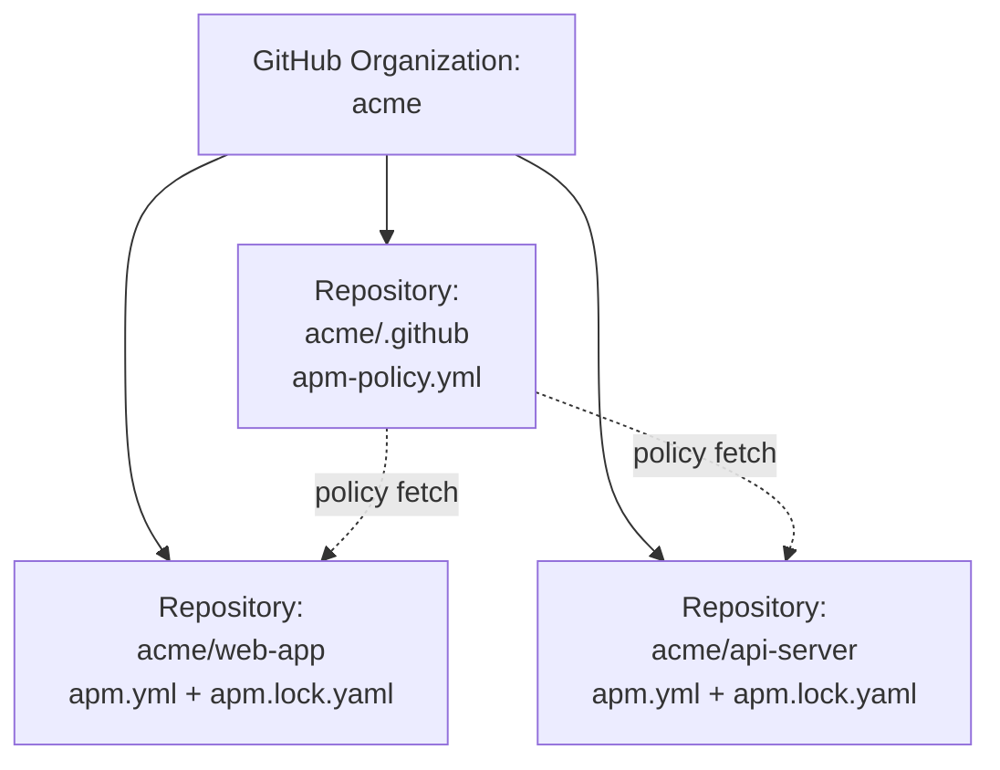
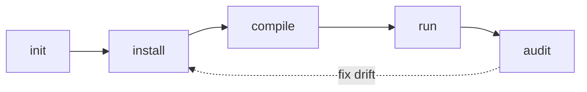
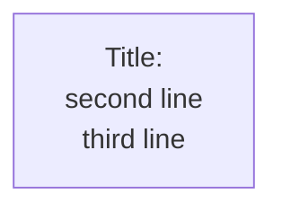
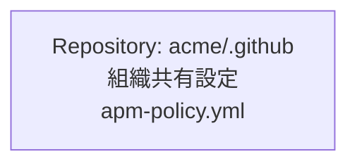

# Phase 4: Japanese Writing Rules

日本語の技術ブログ記事として読みやすいテキストを書くためのルール集。

## 大原則: ルー語禁止

**ルー語** = 英単語を不必要に日本語文に混入させる話法（タレントのルー大柴に由来）。

### NG: 英動詞のサ変動詞化

英単語を「〜する」「〜される」の形で動詞化しない：

| NG | OK |
|---|---|
| gate される | ゲートにかけられる / 関門で止まる / 検査される |
| scan する | スキャンする / 検査する |
| pin する | 固定する / ピン留めする |
| fan-out する | 展開する / 配信する |
| embed する | 埋め込む |
| intersect する | 交差する |
| union する | 和をとる |
| fail-closed する | 失敗時にブロックする |
| compile する | コンパイルする（OK。カタカナ語として日本語化済み） |
| install する | インストールする（OK。同上） |

判断軸：**そのカタカナ語が日本語として既に流通しているか**。「インストール」「スキャン」「コンパイル」「マージ」は OK。「ゲート（する）」「ピン（する）」「フェイルクローズド（する）」は不自然。

### OK: 固有名詞・術語の英語表記

技術用語を **対象を指す名詞** として地のまま使うのは OK。記事のトーンに馴染む：

- `apm.yml`, `lockfile`, `manifest`, `primitive`, `harness`, `frontmatter`
- `Pull Request`, `branch`, `merge commit`
- `OpenTelemetry`, `Prometheus`, `Kubernetes`

これらをカタカナに直す（「ロックファイル」「マニフェスト」など）かは趣味の問題。記事全体で **一貫させる** ことだけ守れば OK。

### 判定の毎回チェック

書きながら、英単語が動詞・形容動詞として活用されていたら一度立ち止まる：
- **「〜する」「〜される」「〜した」が後ろにあるか** → ある場合は要警戒
- 訳語が存在するなら訳語に置き換える
- 訳語が無いなら、英単語をそのまま使うのは諦めて、文を組み替える

## 箇条書きの文末スタイル統一

1 つの箇条書きグループ内で文末を混ぜない：

### NG: 混在パターン

```markdown
1. **manifest-parse** ─ `apm.yml` の YAML 構文と APM スキーマ            ← 名詞句
2. **lockfile-exists** ─ 依存があれば `apm.lock.yaml` も存在せよ          ← 命令形
3. **ref-consistency** ─ 参照が一致せよ                                  ← 命令形
4. **deployed-files-present** ─ 全配布ファイルがディスクに存在せよ        ← 命令形
5. **no-orphaned-packages** ─ パッケージは無いこと                       ← 体言止め
```

文末がバラバラ。読みづらい。

### OK: 「~こと」体言止めで統一

```markdown
1. **manifest-parse** ─ `apm.yml` の YAML 構文と APM スキーマが妥当であること
2. **lockfile-exists** ─ 依存が宣言されているなら `apm.lock.yaml` も存在すること
3. **ref-consistency** ─ `apm.yml` の各依存の ref と lockfile の `resolved_ref` が一致すること
4. **deployed-files-present** ─ lockfile に記録された配布ファイルがすべてディスク上に実在すること
5. **no-orphaned-packages** ─ lockfile に記録されたパッケージがすべて `apm.yml` 側にも宣言されていること
```

### OK: 動詞句「~する」で統一

```markdown
1. ファイル A を読む
2. ファイル B のハッシュを計算する
3. 結果を JSON で出力する
```

### スタイル選択の目安

| スタイル | 使う場面 |
|---|---|
| 「~こと」体言止め | 検証項目、要件、命題列挙 |
| 「~する」動詞句 | 手順、操作列挙 |
| 名詞句 | 短い項目列挙、定義列挙 |

**一つの箇条書きグループでは 1 つのスタイルに揃える**。グループが変われば別スタイルでも構わない。

## コードブロック

### fenced + 言語指定

必ず言語指定する（markdownlint MD040 対策、シンタックスハイライト対応）：

```yaml
# OK
name: my-package
```

```bash
# OK
apm install
```

```text
# OK（プレーンテキストにも text を付ける）
hello world
```

NG: 言語指定なしの fenced code block。

### 言語タグの選び方

| 内容 | タグ |
|---|---|
| YAML | `yaml` |
| シェルコマンド | `bash` または `sh` |
| TypeScript / JS | `typescript` / `javascript` |
| 設定ファイル（汎用） | `text` |
| ディレクトリツリー | `text` |
| 環境変数の export 例 | `bash` |
| 出力ログ | `text` |

## 図とダイアグラム

### 図は Mermaid で書く

技術ブログ記事の図は **Mermaid コードブロック** で書く。理由：

- GitHub / VS Code / mintlify など主要な Markdown レンダラで自動的に図に変換される
- バージョン管理しやすい（テキストなので diff が読める）
- ASCII art は等幅フォント前提なので、プロポーショナルフォントで render されると崩れる

ASCII art は使わない。ディレクトリツリーで罫線文字 `├ │ └` を並べたくなる気持ちはわかるが、Mermaid の `graph` または `flowchart` で代替する。

### Mermaid の基本パターン

**組織 / リポジトリ構造（graph TB）**:

````markdown

````

**ライフサイクル / 状態遷移（graph LR）**:

````markdown

````

### 改行は `<br>` で行う（Mermaid の仕様）

Mermaid のノードラベル内で改行したいとき、`\n` ではなく **`<br>`** を使う：



`\n` は Mermaid の多くのレンダラで正しく改行されない。`<br>` が事実上の標準。

### 図の中で日本語ラベルを使うとき

日本語の場合も `<br>` で改行する。スペース区切りで折り返したいときは明示的に `<br>` を入れる：



### 表は Markdown table

罫線文字で表を書かない。Markdown table が GitHub / VS Code / console すべてで揃って読める：

```markdown
| カラム 1 | カラム 2 |
|---|---|
| 値 A | 値 B |
```

## 文体

- **「である」調を基本** ── 技術記事として引き締まる。「です・ます」調にしたい場合は最初に方針を決めて全編統一
- **段落は短く** ── 1 段落 3〜5 文程度。長い段落は読まれない
- **太字は強調ポイント限定** ── `**` を多用しない。1 段落に 1〜2 個まで
- **─** （長ダッシュ）は内容を補強する挿入句に使う ── 「── これが APM の主張だ」のように
- **「だ・である」と「です・ます」を混ぜない**

## カタカナ語の長音

JIS Z 8301 系の業界ルール（語末長音を省略）には従わず、**自然な日本語表記** を優先する：

- OK: `サーバー`, `ユーザー`, `コンピューター`, `フォルダー`
- 旧 JIS（避ける）: `サーバ`, `ユーザ`, `コンピュータ`, `フォルダ`

ただし、ライブラリ名・製品名は公式表記を優先。

## 数字と単位

- 半角数字を基本にする ── 「3 つの約束」「5 ファイル以下」
- 単位との間に半角スペース ── 「30 分」「12,000 字」「7 ハーネス」
- 3 桁区切りはカンマ ── `12,000` `1,000,000`

## 専門用語の前振り

専門用語の **初出時** は必ず以下のいずれかで対応：
1. 1 文で短く定義する
2. 後の節で詳しく説明することを明示する（「3 つの約束 ── 後述する What セクションで詳しく見る」など）
3. リンクを張る（後続節へのアンカーリンク）

「Promise 2」のような **内部用語** を定義なしで使うと読者が止まる。
